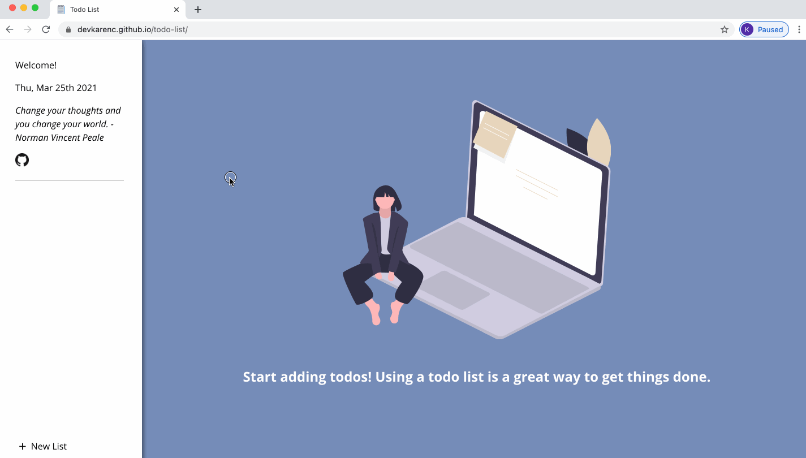

# Todo List 📝

This is a simple todo list app with multiple todo lists and todo items.

## Features ✏️

This [todo list](https://devkarenc.github.io/todo-list/) can:

- [x] Display the current date and a motivational quote from famous individuals
- [x] Persist and save todo list and todo item data across different browser sessions using localStorage
- [x] Display a welcome page to encourage user to start adding todo items
- [x] Add and remove todo lists and edit the names of todo lists
- [x] Add, edit, and remove todo items in todo lists
- [x] Mark todo items as important with a star icon and complete with a checkbox
- [x] Save notes for todo items that user can refer to in the future
- [x] Note due date for todo items

## Demo

